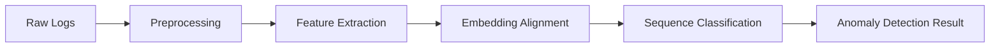
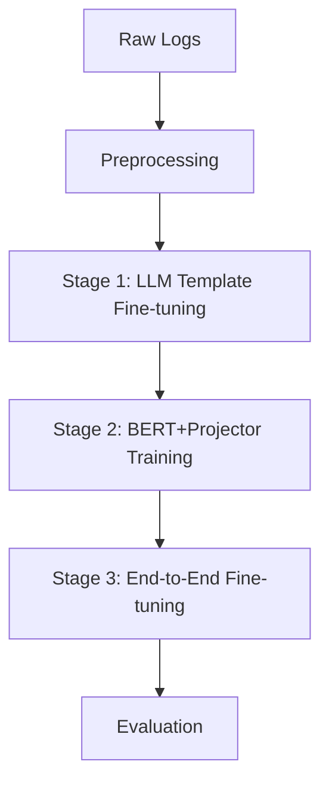

# LogGuardian

[](https://opensource.org/licenses/MIT)
[](https://www.python.org/downloads/)
[](https://pytorch.org/)
[](https://huggingface.co/docs/transformers/index)

## 📋 Table of Contents

- [Overview](#overview)
- [Features](#features)
- [Architecture](#architecture)
- [Prerequisites](#prerequisites)
- [Installation](#installation)
- [Getting Started](#getting-started)
- [Usage Examples](#usage-examples)
- [API Reference](#api-reference)
- [Configuration Options](#configuration-options)
- [Datasets](#datasets)
- [Training](#training)
- [Evaluation](#evaluation)
- [Troubleshooting](#troubleshooting)
- [Contributing](#contributing)
- [License](#license)

## 🌟 Overview

LogGuardian is a Python-based log anomaly detection system leveraging large language models (LLMs) to detect anomalies in system logs by combining semantic extraction and classification. The system implements the LogLLM methodology, extracting semantic features from logs using BERT, aligning them with an LLM's embedding space, and performing anomaly classification using Llama 3.

### Target Audience

LogGuardian is designed for:
- System administrators monitoring server and application logs
- DevOps engineers implementing automated monitoring solutions
- Security analysts looking for anomalous patterns in system logs
- Researchers exploring LLM applications in anomaly detection

## ✨ Features

- **Advanced Preprocessing**: Automatically masks variable parts (IPs, timestamps, paths) in logs
- **Semantic Understanding**: Captures the contextual meaning of log messages
- **Three-Stage Training**: Implements the specialized training procedure from the LogLLM paper:
  - Stage 1: LLM template fine-tuning
  - Stage 2: BERT and projector training
  - Stage 3: End-to-end fine-tuning
- **Data Imbalance Handling**: Implements minority class oversampling with configurable target proportion
- **Comprehensive Dataset Support**: Works with all standard benchmark datasets:
  - HDFS (Hadoop Distributed File System logs)
  - BGL (Blue Gene/L supercomputer logs)
  - Liberty (Liberty supercomputer logs)
  - Thunderbird (Thunderbird supercomputer logs)
- **High Accuracy**: Achieves F1-scores above 0.95 on benchmark datasets
- **Evaluation Framework**: Includes metrics, evaluator, and benchmark tools for rigorous performance assessment
- **Resource Efficient**: Uses QLoRA for memory-efficient fine-tuning
- **Flexible Pipeline**: Modular design allows component replacement or customization
- **Easy Integration**: Simple API for incorporating into existing monitoring systems

## 🏗️ Architecture

LogGuardian follows a modular pipeline architecture with the following components:



1. **Data Preprocessing**: Cleans and standardizes log messages, masking dynamic variables
2. **Semantic Feature Extraction**: Uses BERT to encode logs into semantic vectors
3. **Embedding Alignment**: Projects BERT embeddings to be compatible with LLM embedding space
4. **Sequence Classification**: Uses Llama 3 to classify log sequences as normal or anomalous

### Three-Stage Training Process

The system implements the LogLLM training methodology with three key stages:



1. **Stage 1**: Fine-tune Llama to capture the answer template with a small number of examples
2. **Stage 2**: Train the embedder (BERT + projector) while keeping the fine-tuned Llama frozen
3. **Stage 3**: Fine-tune the entire model end-to-end for optimal performance

## 🔧 Prerequisites

Before installing LogGuardian, ensure you have the following:

- Python 3.8 or higher
- CUDA-compatible GPU with at least 8GB VRAM (for training) or 4GB (for inference)
- 16GB+ RAM
- 50GB+ disk space for models and datasets

### Required Software:

- [CUDA Toolkit](https://developer.nvidia.com/cuda-toolkit) (11.7+ recommended)
- [Git](https://git-scm.com/downloads) for cloning the repository

## 📦 Installation

### Option 1: Install from PyPI (Recommended)

```bash
# Create a virtual environment
python -m venv logguardian-env
source logguardian-env/bin/activate  # On Windows: logguardian-env\Scripts\activate

# Install LogGuardian
pip install logguardian
```

### Option 2: Install from Source

```bash
# Clone the repository
git clone https://github.com/example/logguardian.git
cd logguardian

# Create a virtual environment
python -m venv venv
source venv/bin/activate  # On Windows: venv\Scripts\activate

# Install in development mode
pip install -e .

# For development dependencies
pip install -e ".[dev]"
```

## 🚀 Getting Started

Here's a quick example to get you started with LogGuardian:

```python
from logguardian import LogGuardian

# Initialize the detector
detector = LogGuardian()

# Load some log data
logs = [
    "2023-02-15 10:12:34 INFO  [server.Main] System startup initiated",
    "2023-02-15 10:12:35 INFO  [server.Config] Loading configuration from /etc/config.json",
    "2023-02-15 10:12:40 ERROR [server.Database] Failed to execute query: table 'users' doesn't exist",
    "2023-02-15 10:12:42 ERROR [server.API] Unhandled exception in request handler: NullPointerException"
]

# Detect anomalies
results = detector.detect(logs, window_size=3, stride=1)

# Print results
for log, is_anomaly in zip(logs, results):
    print(f"{'ANOMALY' if is_anomaly else 'NORMAL'}: {log}")
```

## 📝 Usage Examples

### Basic Anomaly Detection

```python
from logguardian import LogGuardian

# Initialize the detector
detector = LogGuardian()

# Load logs from a file
with open('server.log', 'r') as f:
    logs = [line.strip() for line in f]

# Detect anomalies
results = detector.detect(logs)

# Count anomalies
anomaly_count = sum(results)
print(f"Found {anomaly_count} anomalies in {len(logs)} log messages")
```

### Working with Sliding Windows

```python
from logguardian import LogGuardian

detector = LogGuardian()

# Use a larger window size and stride
results = detector.detect(logs, window_size=20, stride=10)
```

### Getting Detailed Results

```python
from logguardian import LogGuardian

detector = LogGuardian()

# Get detailed classification results
detailed_results = detector.detect(logs, raw_output=True)

# Examine results
for result in detailed_results:
    print(f"Label: {result['label']}, Confidence: {result['confidence']}")
```

### Using Custom Preprocessor

```python
from logguardian import LogGuardian
from logguardian.data.preprocessors import SystemLogPreprocessor

# Configure custom preprocessor
preprocessor_config = {
    "case_sensitive": True,
    "remove_punctuation": True
}

# Create preprocessor with custom config
preprocessor = SystemLogPreprocessor(preprocessor_config)

# Initialize detector with custom preprocessor
detector = LogGuardian(preprocessor=preprocessor)

# Use as before
results = detector.detect(logs)
```

### Saving and Loading Models

```python
from logguardian import LogGuardian

# Initialize and train
detector = LogGuardian()
# ... training code ...

# Save the model
detector.save("path/to/saved/model")

# Later, load the model
loaded_detector = LogGuardian.load("path/to/saved/model")

# Use the loaded model
results = loaded_detector.detect(logs)
```

## 📘 API Reference

### LogGuardian Class

The main class for the log anomaly detection system.

```python
LogGuardian(
    preprocessor=None,  # Optional: Custom log preprocessor
    feature_extractor=None,  # Optional: Custom feature extractor
    embedding_projector=None,  # Optional: Custom embedding projector
    classifier=None,  # Optional: Custom classifier
    device=None,  # Optional: Device to run on (e.g., 'cuda', 'cpu')
    config=None  # Optional: Configuration dictionary
)
```

#### Methods

##### `detect(logs, batch_size=16, window_size=10, stride=5, raw_output=False)`

Detects anomalies in log data.

**Parameters:**
- `logs` (Union[str, List[str]]): Single log message or list of log messages
- `batch_size` (int): Size of batches for processing
- `window_size` (int): Size of sliding window for sequences
- `stride` (int): Stride of sliding window
- `raw_output` (bool): Whether to return raw classification outputs

**Returns:**
- If `raw_output=False`: List of anomaly labels (1 for anomaly, 0 for normal)
- If `raw_output=True`: List of dictionaries with detailed outputs including confidence scores

##### `save(path)`

Saves the pipeline to a directory.

**Parameters:**
- `path` (str): Path to save the pipeline to

##### `load(path, device=None, **kwargs)`

Class method to load a pipeline from a directory.

**Parameters:**
- `path` (str): Path to load the pipeline from
- `device` (Optional[str]): Device to load the pipeline onto
- `**kwargs`: Additional keyword arguments for loading models

**Returns:**
- Loaded LogGuardian instance

### Component Classes

#### SystemLogPreprocessor

```python
SystemLogPreprocessor(config=None)
```

**Methods:**
- `preprocess(log_message)`: Preprocesses a single log message
- `preprocess_batch(log_messages)`: Preprocesses a batch of log messages
- `add_pattern(name, pattern, token)`: Adds a new pattern for variable masking
- `remove_pattern(name)`: Removes a pattern by name

#### BertFeatureExtractor

```python
BertFeatureExtractor(
    model_name="bert-base-uncased",
    max_length=128,
    pooling_strategy="cls",
    device=None,
    config=None
)
```

**Methods:**
- `encode(texts, batch_size=32, return_numpy=False)`: Encode texts into feature vectors
- `save(path)`: Save the model and tokenizer to a directory
- `load(path, device=None)`: Load a saved model from a directory

#### EmbeddingProjector

```python
EmbeddingProjector(
    input_dim,
    output_dim,
    dropout=0.1,
    use_batch_norm=True,
    device=None,
    config=None
)
```

**Methods:**
- `project(embeddings, return_numpy=False)`: Project embeddings to target space
- `save(path)`: Save the projection model to a file
- `load(path, device=None)`: Load a saved model from a directory

#### LlamaLogClassifier

```python
LlamaLogClassifier(
    model_name_or_path="meta-llama/Llama-3-8b",
    tokenizer=None,
    model=None,
    system_prompt=None,
    prompt_template=None,
    labels=None,
    max_length=2048,
    generation_config=None,
    load_in_8bit=True,
    load_in_4bit=False,
    device=None,
    device_map="auto",
    config=None
)
```

**Methods:**
- `classify(log_sequence, raw_output=False)`: Classify a single log sequence
- `classify_batch(log_sequences, raw_output=False, batch_size=8)`: Classify a batch of log sequences
- `add_lora_adapters(lora_rank=8, lora_alpha=16, lora_dropout=0.05, target_modules=None)`: Add LoRA adapters for fine-tuning
- `save(path)`: Save the classifier to a directory
- `load(path, device=None, device_map="auto", **kwargs)`: Load a classifier from a directory

### Training Classes

#### ThreeStageTrainer

```python
ThreeStageTrainer(
    model,  # LogGuardian model to train
    device=None,  # Optional: Device to use for training
    config=None  # Optional: Configuration parameters
)
```

**Methods:**
- `setup_stage1(learning_rate=5e-4, warmup_steps=100, weight_decay=0.01, **kwargs)`: Set up Stage 1 training
- `setup_stage2(learning_rate=5e-5, warmup_steps=0, weight_decay=0.01, **kwargs)`: Set up Stage 2 training
- `setup_stage3(learning_rate=5e-5, warmup_steps=0, weight_decay=0.01, **kwargs)`: Set up Stage 3 training
- `run_stage1(train_loader, criterion, eval_loader=None, metrics=None, num_epochs=1, num_samples=1000, **kwargs)`: Run Stage 1 training
- `run_stage2(train_loader, criterion, eval_loader=None, metrics=None, num_epochs=2, **kwargs)`: Run Stage 2 training
- `run_stage3(train_loader, criterion, eval_loader=None, metrics=None, num_epochs=2, **kwargs)`: Run Stage 3 training
- `train(train_loader, criterion, eval_loader=None, metrics=None, **kwargs)`: Run complete three-stage training

### Evaluation Classes

#### Evaluator

```python
Evaluator(
    model,  # LogGuardian model to evaluate
    config=None  # Optional: Configuration parameters
)
```

**Methods:**
- `evaluate(test_logs, test_labels, dataset_name="unnamed_dataset", batch_size=16, raw_output=True, save_results=True, **kwargs)`: Evaluate model on test dataset
- `cross_validate(logs, labels, dataset_name="unnamed_dataset", n_splits=5, stratify=True, random_state=42, time_based=False, **kwargs)`: Perform cross-validation
- `generate_report(dataset_results=None, output_file=None)`: Generate evaluation report

#### LogAnomalyBenchmark

```python
LogAnomalyBenchmark(
    methods=None,  # Dictionary of methods to benchmark, mapping method names to models
    datasets=None,  # Dictionary of datasets to benchmark on, mapping dataset names to (logs, labels) tuples
    config=None  # Optional: Configuration parameters
)
```

**Methods:**
- `add_method(name, model)`: Add a method to benchmark
- `add_dataset(name, logs, labels)`: Add a dataset to benchmark on
- `load_dataset_from_loader(name, loader, split=True, test_size=0.2, shuffle=False, random_state=42)`: Load a dataset from a data loader
- `run(method_names=None, dataset_names=None, save_results=True, generate_report=True, train_methods=True, **kwargs)`: Run benchmark
- `generate_report(benchmark_results=None, output_file=None)`: Generate benchmark report
- `create_comparison_visualizations(metric="f1", output_dir=None)`: Create comparative visualizations

## ⚙️ Configuration Options

LogGuardian can be configured through the `config` parameter when creating an instance. Here's an example configuration:

```python
config = {
    "preprocessor": {
        "case_sensitive": False,
        "remove_punctuation": False,
        "patterns": {
            # Custom patterns
            "custom_id": r"ID-\d+",
        },
        "tokens": {
            "custom_id": "<ID>",
        }
    },
    "feature_extractor": {
        "model_name": "bert-base-uncased",
        "max_length": 128,
        "pooling_strategy": "cls"  # Options: "cls", "mean", "max"
    },
    "embedding_projector": {
        "input_dim": 768,  # BERT base hidden size
        "output_dim": 4096,  # Llama hidden size
        "dropout": 0.1,
        "use_batch_norm": True
    },
    "classifier": {
        "model_name": "meta-llama/Llama-3-8b",
        "max_length": 2048,
        "load_in_8bit": True,
        "load_in_4bit": False,
        "system_prompt": "You are a log analysis expert...",
        "generation_config": {
            "max_new_tokens": 50,
            "temperature": 0.1,
            "top_p": 0.9,
            "top_k": 50,
            "do_sample": False,
        }
    }
}

detector = LogGuardian(config=config)
```

## 📊 Datasets

LogGuardian supports multiple benchmark datasets:

### HDFS Dataset

The Hadoop Distributed File System (HDFS) dataset is a widely used benchmark for log anomaly detection.

```python
from logguardian.data.loaders import HDFSLoader
from logguardian.data.preprocessors import SystemLogPreprocessor

# Create preprocessor
preprocessor = SystemLogPreprocessor()

# Create loader with preprocessor
loader = HDFSLoader(preprocessor=preprocessor, config={"data_path": "path/to/hdfs"})

# Load data
logs, labels = loader.load()

# Get train/test split
train_logs, train_labels, test_logs, test_labels = loader.get_train_test_split(
    test_size=0.2, 
    shuffle=True,
    random_state=42
)
```

### BGL Dataset

The Blue Gene/L (BGL) dataset contains logs from a supercomputer at Lawrence Livermore National Labs.

```python
from logguardian.data.loaders import BGLLoader

# Create loader with sliding window configuration
loader = BGLLoader(
    preprocessor=preprocessor,
    config={
        "data_path": "path/to/bgl",
        "window_size": 100,
        "step_size": 100
    }
)

# Load and split data with chronological ordering
logs, labels = loader.load()
train_logs, train_labels, test_logs, test_labels = loader.get_train_test_split(
    test_size=0.2,
    shuffle=False  # Use chronological splitting
)
```

### Liberty and Thunderbird Datasets

Similar to BGL, Liberty and Thunderbird datasets contain logs from supercomputer systems.

```python
from logguardian.data.loaders import LibertyLoader, ThunderbirdLoader

# Load Liberty dataset
liberty_loader = LibertyLoader(
    preprocessor=preprocessor,
    config={"data_path": "path/to/liberty", "window_size": 100, "step_size": 100}
)

# Load Thunderbird dataset
thunderbird_loader = ThunderbirdLoader(
    preprocessor=preprocessor,
    config={"data_path": "path/to/thunderbird", "window_size": 100, "step_size": 100}
)
```

### Example: Loading Multiple Datasets

```python
from logguardian.data.loaders import HDFSLoader, BGLLoader, LibertyLoader, ThunderbirdLoader
from logguardian.evaluation.benchmark import LogAnomalyBenchmark

# Create benchmark object
benchmark = LogAnomalyBenchmark()

# Load datasets
benchmark.load_dataset_from_loader("hdfs", HDFSLoader(data_path="path/to/hdfs"))
benchmark.load_dataset_from_loader("bgl", BGLLoader(data_path="path/to/bgl"))
benchmark.load_dataset_from_loader("liberty", LibertyLoader(data_path="path/to/liberty"))
benchmark.load_dataset_from_loader("thunderbird", ThunderbirdLoader(data_path="path/to/thunderbird"))
```

## 🏋️ Training

LogGuardian implements the three-stage training procedure described in the LogLLM paper.

### Three-Stage Training

```python
from logguardian import LogGuardian
from logguardian.data.loaders import HDFSLoader
from logguardian.training.three_stage_trainer import ThreeStageTrainer
import torch.nn as nn

# Load dataset
loader = HDFSLoader(data_path="path/to/hdfs")
train_logs, train_labels, test_logs, test_labels = loader.get_train_test_split()

# Create dataset and data loader
# [Code for creating PyTorch DataLoader]

# Initialize detector
detector = LogGuardian()

# Create trainer
trainer = ThreeStageTrainer(detector)

# Define loss function
criterion = nn.CrossEntropyLoss()

# Run three-stage training
results = trainer.train(
    train_loader=train_loader,
    criterion=criterion,
    eval_loader=val_loader,
    num_epochs_stage1=1,
    num_samples_stage1=1000,
    num_epochs_stage2=2,
    num_epochs_stage3=2,
    learning_rate_stage1=5e-4,
    learning_rate_stage2=5e-5,
    learning_rate_stage3=5e-5
)

# Save the trained model
detector.save("trained_model")
```

### Using the Training Example Script

LogGuardian includes a comprehensive training example script:

```bash
python -m logguardian.examples.train_with_three_stage --data_path path/to/hdfs --output_dir output --batch_size 16 --beta 0.3
```

### Fine-tuning with LoRA

```python
from logguardian import LogGuardian
from logguardian.data.loaders import HDFSLoader
import torch

# Load dataset
loader = HDFSLoader(config={"data_path": "path/to/hdfs"})
train_logs, train_labels, test_logs, test_labels = loader.get_train_test_split()

# Initialize detector
detector = LogGuardian()

# Add LoRA adapters to the classifier
detector.classifier.add_lora_adapters(
    lora_rank=8,
    lora_alpha=16,
    lora_dropout=0.05
)

# Fine-tuning parameters
batch_size = 8
learning_rate = 2e-5
num_epochs = 3

# Set up optimizer
optimizer = torch.optim.AdamW(detector.classifier.model.parameters(), lr=learning_rate)
loss_fn = torch.nn.CrossEntropyLoss()

# Training loop
for epoch in range(num_epochs):
    # Process in batches
    for i in range(0, len(train_logs), batch_size):
        batch_logs = train_logs[i:i+batch_size]
        batch_labels = train_labels[i:i+batch_size]
        
        # Forward pass and loss calculation
        # ... (custom training code) ...
        
        # Backward pass
        loss.backward()
        optimizer.step()
        optimizer.zero_grad()

# Save the fine-tuned model
detector.save("fine_tuned_model")
```

## 📊 Evaluation

LogGuardian includes a comprehensive evaluation framework for assessing model performance.

### Basic Evaluation

```python
from logguardian import LogGuardian
from logguardian.data.loaders import HDFSLoader
from logguardian.evaluation.evaluator import Evaluator

# Load model
detector = LogGuardian.load("path/to/model")

# Load test data
loader = HDFSLoader(data_path="path/to/hdfs")
_, _, test_logs, test_labels = loader.get_train_test_split(test_size=0.2)

# Create evaluator
evaluator = Evaluator(detector, config={"output_dir": "evaluation_results"})

# Evaluate model
results = evaluator.evaluate(
    test_logs=test_logs,
    test_labels=test_labels,
    dataset_name="hdfs_test",
    batch_size=16
)

# Generate report
report = evaluator.generate_report(output_file="evaluation_report.md")
```

### Benchmarking

```python
from logguardian import LogGuardian
from logguardian.data.loaders import HDFSLoader, BGLLoader
from logguardian.evaluation.benchmark import LogAnomalyBenchmark

# Create benchmark object
benchmark = LogAnomalyBenchmark(
    config={"output_dir": "benchmark_results"}
)

# Load datasets
benchmark.load_dataset_from_loader("hdfs", HDFSLoader(data_path="path/to/hdfs"))
benchmark.load_dataset_from_loader("bgl", BGLLoader(data_path="path/to/bgl"))

# Add methods
benchmark.add_method("LogGuardian", LogGuardian())
# Add other methods for comparison

# Run benchmark
results = benchmark.run(
    save_results=True,
    generate_report=True
)

# Create visualizations
benchmark.create_comparison_visualizations(metric="f1")
```

### Using the Benchmark Example Script

LogGuardian includes a comprehensive benchmark example script:

```bash
python -m logguardian.examples.benchmark_example --data_dir path/to/datasets --datasets hdfs bgl liberty thunderbird --include_baselines --output_dir benchmark_results
```

## 🔍 Troubleshooting

### Common Issues and Solutions

#### CUDA Out of Memory Error

**Problem**: `RuntimeError: CUDA out of memory`

**Solution**:
- Reduce batch size
- Use 4-bit quantization by setting `load_in_4bit=True` in the classifier config
- Use a smaller model variant
- Process logs in smaller windows

```python
# Use 4-bit quantization
config = {
    "classifier": {
        "load_in_8bit": False,
        "load_in_4bit": True
    }
}
detector = LogGuardian(config=config)
```

#### Slow Processing

**Problem**: Log processing is too slow

**Solution**:
- Increase batch size for faster processing (if memory allows)
- Reduce max_length parameter
- Use CPU offloading for parts of the model

```python
# Use CPU offloading with optimized batch size
config = {
    "classifier": {
        "device_map": {"model.embed_tokens": 0, "model.norm": 0, "lm_head": 0, "model.layers.0": 0, "model.layers.1": "cpu"}
    }
}
detector = LogGuardian(config=config)
```

#### Tokenizer Errors

**Problem**: `ValueError: Asking to pad but the tokenizer does not have a padding token.`

**Solution**:
- Ensure you're using a compatible tokenizer
- Set padding token explicitly

```python
from transformers import AutoTokenizer

tokenizer = AutoTokenizer.from_pretrained("meta-llama/Llama-3-8b")
tokenizer.pad_token = tokenizer.eos_token
```

### Debugging Tips

- Enable detailed logging with `loguru`:

```python
from loguru import logger
import sys

# Configure logger
logger.remove()
logger.add(sys.stderr, level="DEBUG")
```

- Run with smaller datasets first to validate your setup
- Test each component separately before running the full pipeline
- Use the `raw_output=True` option to get detailed classification results for debugging

## 🤝 Contributing

We welcome contributions to LogGuardian! Here's how you can help:

### Setting Up Development Environment

```bash
# Clone the repository
git clone https://github.com/example/logguardian.git
cd logguardian

# Create a virtual environment
python -m venv venv
source venv/bin/activate  # On Windows: venv\Scripts\activate

# Install development dependencies
pip install -e ".[dev]"
```

### Code Style

We use the following tools to ensure code quality:

- `black` for code formatting
- `isort` for import sorting
- `mypy` for type checking
- `pytest` for testing

Before submitting a pull request, run:

```bash
# Format code
black .
isort .

# Type checking
mypy logguardian

# Run tests
pytest
```

### Pull Request Process

1. Fork the repository
2. Create a feature branch (`git checkout -b feature/amazing-feature`)
3. Commit your changes (`git commit -m 'Add amazing feature'`)
4. Push to the branch (`git push origin feature/amazing-feature`)
5. Open a Pull Request

## 📄 License

LogGuardian is released under the MIT License. See the [LICENSE](LICENSE) file for details.

```
MIT License

Copyright (c) 2025 LogGuardian Team

Permission is hereby granted, free of charge, to any person obtaining a copy
of this software...
```

---

## 📬 Contact

For questions, feedback, or issues, please [open an issue](https://github.com/example/logguardian/issues) on GitHub.