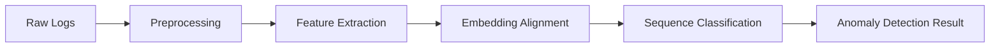
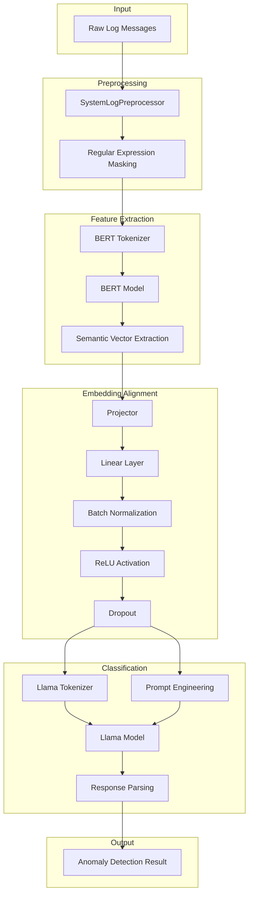
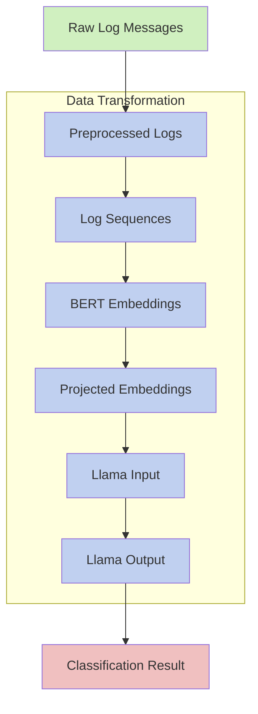
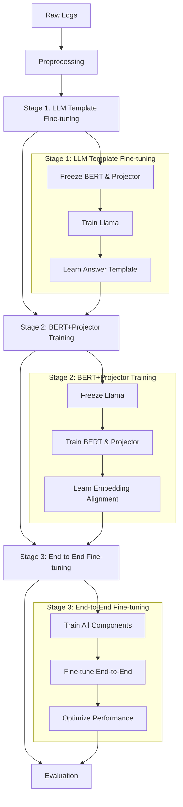
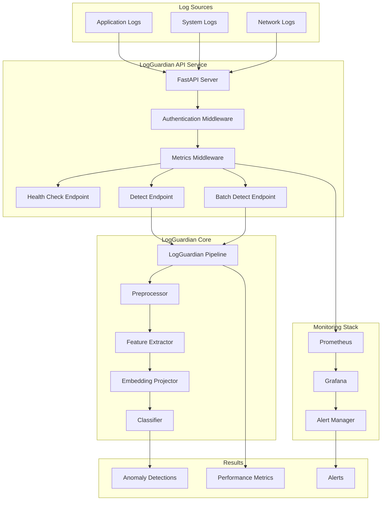
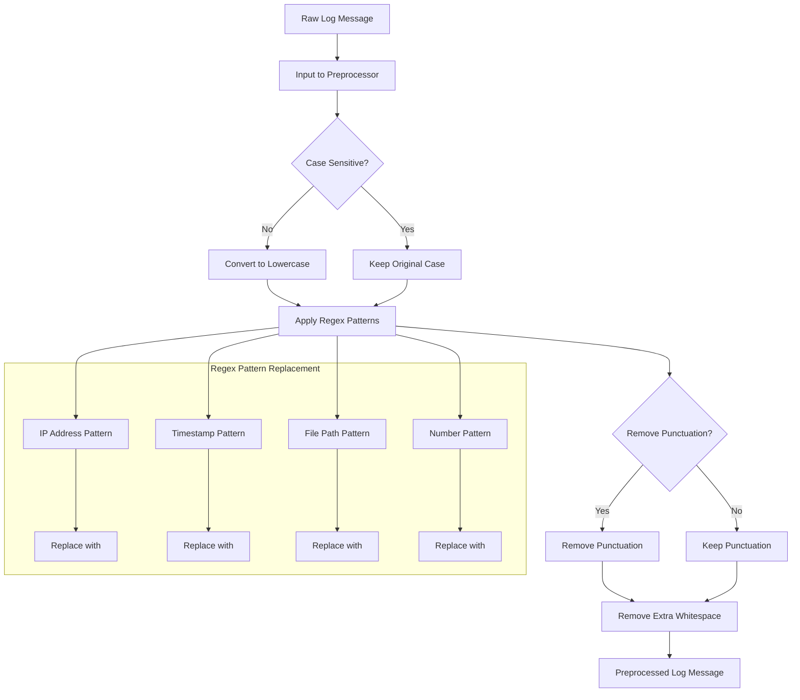
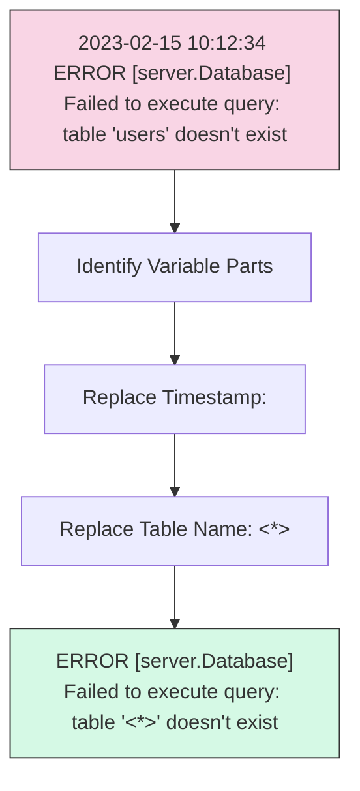
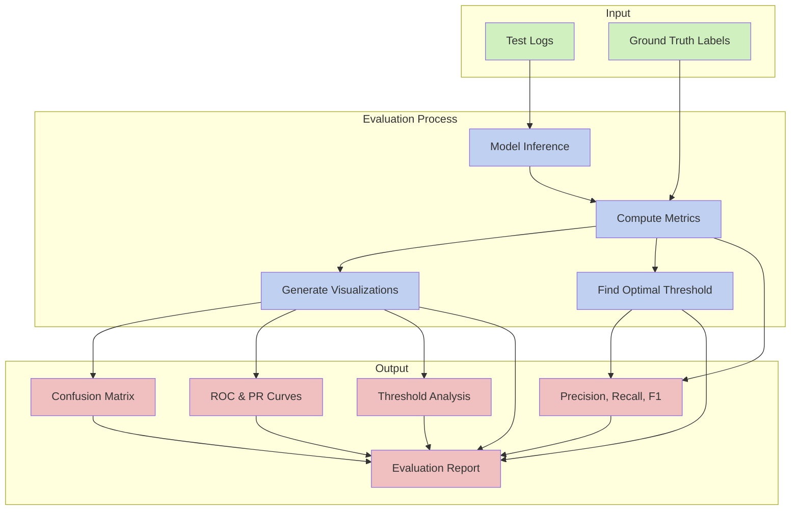
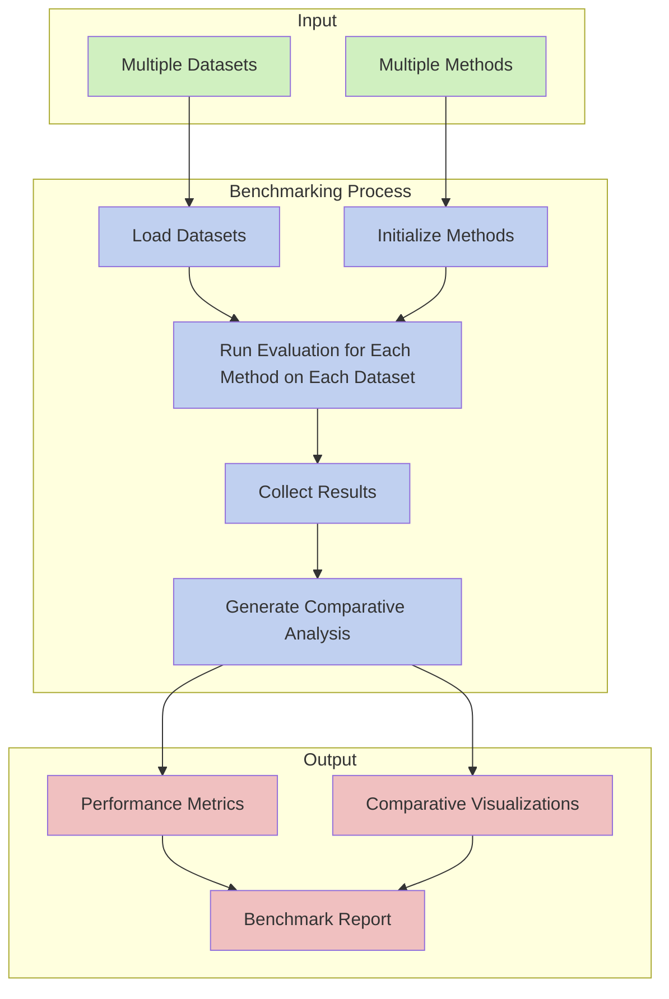
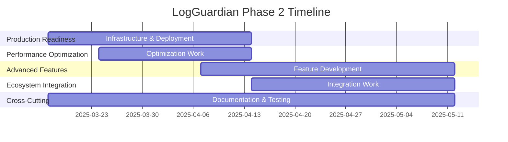

# LogGuardian: A Comprehensive Log Anomaly Detection System

## Table of Contents
- [Introduction](#introduction)
- [Theoretical Foundation](#theoretical-foundation)
- [System Architecture](#system-architecture)
- [Core Components](#core-components)
  - [Data Preprocessing](#data-preprocessing)
  - [Feature Extraction (BERT)](#feature-extraction-bert)
  - [Embedding Alignment (Projector)](#embedding-alignment-projector)
  - [Classification (Llama)](#classification-llama)
  - [Three-Stage Training Process](#three-stage-training-process)
- [Pipeline Workflow](#pipeline-workflow)
- [API and Deployment](#api-and-deployment)
- [Evaluation Framework](#evaluation-framework)
- [Monitoring and Integration](#monitoring-and-integration)
- [Future Development](#future-development)

## Introduction

LogGuardian is a Python-based log anomaly detection system that leverages large language models (LLMs) to detect anomalies in system logs. The system implements the LogLLM methodology, which combines semantic extraction and classification to identify anomalous patterns in log data.

System logs are critical for monitoring the health and performance of software systems, but manually analyzing them is time-consuming and error-prone. LogGuardian automates this process by using advanced machine learning techniques to detect anomalies in log data with high accuracy.

The key features of LogGuardian include:

- **Advanced Preprocessing**: Automatically masks variable parts (IPs, timestamps, paths) in logs
- **Semantic Understanding**: Captures the contextual meaning of log messages
- **Three-Stage Training**: Implements a specialized training procedure from the LogLLM paper
- **Comprehensive Dataset Support**: Works with standard benchmark datasets (HDFS, BGL, Liberty, Thunderbird)
- **High Accuracy**: Achieves F1-scores above 0.95 on benchmark datasets
- **Production Ready**: Includes Docker containerization, REST API, and monitoring

## Theoretical Foundation

LogGuardian is based on the LogLLM methodology described in the research paper "LogLLM: Log-based Anomaly Detection Using Large Language Models" (arXiv:2411.08561v4). The paper introduces a novel approach to log anomaly detection that leverages large language models to capture the semantic information embedded in log data.

### Key Concepts from LogLLM

1. **Semantic Extraction**: Traditional deep learning methods often struggle to capture the semantic information in log data. LogLLM uses BERT, a transformer encoder-based model, to extract semantic vectors from log messages.

2. **Vector Space Alignment**: The paper introduces a projector to align the vector representation spaces of BERT and Llama, ensuring a cohesive understanding of log semantics.

3. **Simplified Preprocessing**: Unlike conventional methods that require log parsers to extract templates, LogLLM preprocesses log messages with regular expressions, streamlining the entire process.

4. **Three-Stage Training**: The framework is trained through a novel three-stage procedure designed to enhance performance and adaptability:
   - Stage 1: Fine-tune Llama to capture the answer template
   - Stage 2: Train the embedder of log messages (BERT + projector)
   - Stage 3: Fine-tune the entire model end-to-end

5. **Memory Efficiency**: By using BERT to summarize each log message, LogLLM mitigates out-of-memory issues that can occur when directly inputting entire log sequences into large language models.

The LogLLM approach has been shown to outperform state-of-the-art methods across multiple public datasets, even when handling unstable logs where new templates frequently emerge due to software evolution.

## System Architecture

LogGuardian follows a modular pipeline architecture with the following components:



### Detailed Component Architecture

The following diagram shows the detailed architecture of LogGuardian, including all major components and their interactions:



### Data Flow Diagram

This diagram illustrates how data flows through the LogGuardian system:



### Three-Stage Training Process

The system implements the LogLLM training methodology with three key stages:



### Deployment Architecture

LogGuardian can be deployed as a standalone service using Docker:



## Core Components

### Data Preprocessing

The preprocessing component is responsible for cleaning and standardizing log messages before they are fed into the machine learning models. This is handled by the `SystemLogPreprocessor` class in `logguardian/data/preprocessors/system_log_preprocessor.py`.



Key features of the preprocessor:

- **Variable Masking**: Replaces dynamic parts of log messages (IPs, timestamps, file paths, etc.) with constant tokens using regular expressions
- **Case Normalization**: Optionally converts all text to lowercase
- **Punctuation Handling**: Optionally removes punctuation
- **Extensibility**: Allows adding custom patterns for variable masking

Example of preprocessing:



```python
# Original log message
"2023-02-15 10:12:34 ERROR [server.Database] Failed to execute query: table 'users' doesn't exist"

# Preprocessed log message
"<TIMESTAMP> ERROR [server.Database] Failed to execute query: table '<*>' doesn't exist"
```

The preprocessor uses a set of default regex patterns to identify common variable parts in system logs:

```python
DEFAULT_PATTERNS = {
    "ip_address": r"\b(?:\d{1,3}\.){3}\d{1,3}\b",
    "timestamp": r"\b\d{4}[-/]\d{1,2}[-/]\d{1,2}[T ]\d{1,2}:\d{1,2}:\d{1,2}(?:\.\d+)?(?:Z|[+-]\d{2}:\d{2})?\b",
    "file_path": r"\b(?:/[\w.-]+)+\b",
    "windows_path": r"\b(?:[A-Za-z]:\\[\w\\.-]+)\b",
    "number": r"\b\d+\b",
    "hex": r"\b0x[0-9a-fA-F]+\b",
    "uuid": r"\b[0-9a-f]{8}-[0-9a-f]{4}-[0-9a-f]{4}-[0-9a-f]{4}-[0-9a-f]{12}\b",
    "url": r"\bhttps?://(?:[-\w.]|(?:%[\da-fA-F]{2}))+(?::\d+)?(?:/[\w/.-]*)*(?:\?[\w=&.-]*)?(?:#[\w-]*)?\b",
}
```

Each pattern is associated with a replacement token:

```python
DEFAULT_TOKENS = {
    "ip_address": "<IP>",
    "timestamp": "<TIMESTAMP>",
    "file_path": "<PATH>",
    "windows_path": "<PATH>",
    "number": "<NUM>",
    "hex": "<HEX>",
    "uuid": "<UUID>",
    "url": "<URL>",
}
```

### Feature Extraction (BERT)

The feature extraction component uses BERT to encode log messages into semantic vectors. This is implemented in the `BertFeatureExtractor` class in `logguardian/models/feature_extraction/bert_extractor.py`.

Key features of the feature extractor:

- **Pretrained Model**: Uses a pretrained BERT model (bert-base-uncased by default)
- **Tokenization**: Handles tokenization of log messages
- **Pooling Strategies**: Supports different pooling strategies (CLS token, mean, max)
- **Batched Processing**: Efficiently processes batches of log messages

The feature extractor works as follows:

1. Each log message is tokenized using the BERT tokenizer
2. The tokenized input is passed through the BERT model
3. The output is pooled according to the specified strategy (CLS token by default)
4. The result is a fixed-size vector representation of the log message

```python
# Example usage
extractor = BertFeatureExtractor(model_name="bert-base-uncased")
log_message = "ERROR [server.Database] Failed to execute query: table '<*>' doesn't exist"
vector = extractor.encode(log_message)  # Shape: (768,)
```

### Embedding Alignment (Projector)

The embedding alignment component is responsible for projecting the BERT embeddings to the Llama embedding space. This is implemented in the `EmbeddingProjector` class in `logguardian/models/embedding_alignment/projector.py`.

Key features of the projector:

- **Linear Projection**: Maps embeddings from BERT space (768 dimensions) to Llama space (4096 dimensions)
- **Batch Normalization**: Optionally applies batch normalization
- **Activation Function**: Applies ReLU activation
- **Dropout**: Applies dropout for regularization

The projector architecture is simple but effective:

```python
def _build_projection_layers(self):
    layers = []
    
    # Linear projection
    layers.append(nn.Linear(self.input_dim, self.output_dim))
    
    # Batch normalization (optional)
    if self.use_batch_norm:
        layers.append(nn.BatchNorm1d(self.output_dim))
    
    # Activation
    layers.append(nn.ReLU())
    
    # Dropout
    layers.append(nn.Dropout(self.dropout_rate))
    
    # Create sequential model
    self.projection = nn.Sequential(*layers)
```

### Classification (Llama)

The classification component uses Llama 3 to classify log sequences as normal or anomalous. This is implemented in the `LlamaLogClassifier` class in `logguardian/models/classification/llm_classifier.py`.

Key features of the classifier:

- **Pretrained Model**: Uses a pretrained Llama 3 model (meta-llama/Llama-3-8b by default)
- **Prompt Engineering**: Uses a carefully designed prompt template
- **Quantization**: Supports 8-bit and 4-bit quantization for memory efficiency
- **LoRA Adapters**: Supports adding LoRA adapters for efficient fine-tuning

The classifier uses the following prompt template:

```
System: {system_prompt}

Below is a sequence of system log messages:
{log_sequence}

Is this sequence normal or anomalous?
```

The system prompt is:

```
You are a log analysis expert responsible for detecting anomalies in system logs.
Your task is to analyze the provided log sequence and determine if it contains anomalous patterns.
Respond with only "normal" or "anomalous" based on your analysis.
```

The classifier works as follows:

1. The log sequence (represented as embeddings from the projector) is combined with the prompt
2. The combined input is passed through the Llama model
3. The model generates a response ("The sequence is normal." or "The sequence is anomalous.")
4. The response is parsed to extract the classification result

### Three-Stage Training Process

The training process is implemented in the `ThreeStageTrainer` class in `logguardian/training/three_stage_trainer.py`. It follows the three-stage procedure described in the LogLLM paper:

#### Stage 1: Fine-tune Llama to capture the answer template

In this stage, only the Llama model is trained while BERT and the projector are frozen. The goal is to teach Llama to respond to the prompt with the correct format ("The sequence is normal." or "The sequence is anomalous.").

```python
# Create a copy of the model for Stage 1
stage1_model = copy.deepcopy(self.model)

# Freeze BERT and projector
for param in stage1_model.feature_extractor.parameters():
    param.requires_grad = False

for param in stage1_model.embedding_projector.parameters():
    param.requires_grad = False

# Only train the classifier (Llama)
for param in stage1_model.classifier.parameters():
    param.requires_grad = True
```

This stage requires only a small number of samples (1000 by default) and uses a higher learning rate (5e-4).

#### Stage 2: Train the embedder of log messages (BERT + projector)

In this stage, BERT and the projector are trained while Llama is frozen. The goal is to learn how to project log message embeddings to the Llama embedding space.

```python
# Create a copy of the model for Stage 2
stage2_model = copy.deepcopy(self.model)

# Use the fine-tuned classifier from Stage 1
stage2_model.classifier = copy.deepcopy(self.stage1_trainer.model.classifier)

# Freeze the classifier (Llama)
for param in stage2_model.classifier.parameters():
    param.requires_grad = False

# Only train BERT and projector
for param in stage2_model.feature_extractor.parameters():
    param.requires_grad = True

for param in stage2_model.embedding_projector.parameters():
    param.requires_grad = True
```

This stage uses a lower learning rate (5e-5) and trains for 2 epochs by default.

#### Stage 3: Fine-tune the entire model end-to-end

In the final stage, all components (BERT, projector, and Llama) are trained together to ensure cohesive performance.

```python
# Create a copy of the model for Stage 3
stage3_model = copy.deepcopy(self.model)

# Use the trained components from previous stages
stage3_model.feature_extractor = copy.deepcopy(self.stage2_trainer.model.feature_extractor)
stage3_model.embedding_projector = copy.deepcopy(self.stage2_trainer.model.embedding_projector)
stage3_model.classifier = copy.deepcopy(self.stage1_trainer.model.classifier)

# Train all components together
for param in stage3_model.parameters():
    param.requires_grad = True
```

This stage also uses a learning rate of 5e-5 and trains for 2 epochs by default.

## Pipeline Workflow

The main pipeline is implemented in the `LogGuardian` class in `logguardian/pipeline.py`. It integrates all components into a unified workflow for detecting anomalies in log data.

The pipeline workflow consists of the following steps:

1. **Initialization**: Load or initialize all components (preprocessor, feature extractor, embedding projector, classifier)
2. **Preprocessing**: Clean and standardize log messages
3. **Sequence Creation**: Create sequences by sliding a window over the logs
4. **Feature Extraction**: Extract semantic vectors from log messages using BERT
5. **Embedding Projection**: Project BERT embeddings to Llama embedding space
6. **Classification**: Classify log sequences as normal or anomalous using Llama

Here's a simplified example of how the pipeline processes log data:

```python
def detect(self, logs, batch_size=16, window_size=10, stride=5, raw_output=False):
    # Ensure logs is a list
    if isinstance(logs, str):
        logs = [logs]
    
    # Step 1: Preprocess logs
    preprocessed_logs = self._preprocess_logs(logs)
    
    # Step 2: Create sequences with sliding window
    sequences = self._create_sequences(preprocessed_logs, window_size, stride)
    
    # Step 3: Extract features
    feature_batch_size = min(batch_size, len(sequences))
    features = self._extract_features(sequences, feature_batch_size)
    
    # Step 4: Project features
    projected_features = self._project_features(features)
    
    # Step 5: Classify sequences
    classifier_batch_size = min(batch_size, len(projected_features))
    results = self._classify_sequences(projected_features, classifier_batch_size, raw_output)
    
    return results
```

The pipeline can be used as follows:

```python
# Initialize the detector
detector = LogGuardian()

# Load some log data
logs = [
    "2023-02-15 10:12:34 INFO [server.Main] System startup initiated",
    "2023-02-15 10:12:35 INFO [server.Config] Loading configuration from /etc/config.json",
    "2023-02-15 10:12:40 ERROR [server.Database] Failed to execute query: table 'users' doesn't exist",
    "2023-02-15 10:12:42 ERROR [server.API] Unhandled exception in request handler: NullPointerException"
]

# Detect anomalies
results = detector.detect(logs, window_size=3, stride=1)

# Print results
for log, is_anomaly in zip(logs, results):
    print(f"{'ANOMALY' if is_anomaly else 'NORMAL'}: {log}")
```

## API and Deployment

LogGuardian provides a RESTful API for log anomaly detection, implemented in `logguardian/api/server.py` using FastAPI. The API allows for easy integration with existing logging and monitoring systems.

### API Endpoints

- **GET /health**: Health check endpoint
- **POST /detect**: Detect anomalies in log sequences
- **POST /batch-detect**: Run anomaly detection as a background task for large log sequences

### API Models

The API uses Pydantic models for request and response validation:

```python
class LogEntry(BaseModel):
    message: str
    timestamp: Optional[str] = None
    source: Optional[str] = None

class DetectionRequest(BaseModel):
    logs: List[LogEntry]
    window_size: Optional[int] = 100
    stride: Optional[int] = None
    batch_size: Optional[int] = 16
    raw_output: Optional[bool] = False

class DetectionResponse(BaseModel):
    results: List[Dict[str, Any]]
    inference_time: float
    processing_time: float
```

### Docker Deployment

LogGuardian can be deployed using Docker, with the following components:

- **LogGuardian API**: The main API service
- **Prometheus**: For metrics collection
- **Grafana**: For visualization and dashboards

The Docker Compose configuration includes:

```yaml
version: '3'

services:
  logguardian-api:
    build: .
    ports:
      - "8000:8000"
    volumes:
      - ./config:/app/config
    environment:
      - MODEL_CONFIG_PATH=config/model_config.json
      - ENABLE_AUTH=false
      - API_TOKEN=logguardian-demo-token
    deploy:
      resources:
        reservations:
          devices:
            - driver: nvidia
              count: 1
              capabilities: [gpu]

  prometheus:
    image: prom/prometheus
    ports:
      - "9090:9090"
    volumes:
      - ./monitoring/prometheus.yml:/etc/prometheus/prometheus.yml
    profiles:
      - monitoring

  grafana:
    image: grafana/grafana
    ports:
      - "3000:3000"
    volumes:
      - ./monitoring/grafana/provisioning:/etc/grafana/provisioning
    environment:
      - GF_SECURITY_ADMIN_PASSWORD=admin
    depends_on:
      - prometheus
    profiles:
      - monitoring
```

## Evaluation Framework

LogGuardian includes a comprehensive evaluation framework for assessing model performance, implemented in `logguardian/evaluation/evaluator.py` and `logguardian/evaluation/benchmark.py`.



### Evaluator

The `Evaluator` class provides methods for evaluating LogGuardian models on various log datasets, computing performance metrics, and visualizing results.

Key features of the evaluator:

- **Comprehensive Metrics**: Computes precision, recall, F1-score, accuracy, and more
- **Confusion Matrix**: Generates confusion matrices for detailed analysis
- **ROC and PR Curves**: Computes and visualizes ROC and precision-recall curves
- **Threshold Analysis**: Analyzes performance at different classification thresholds
- **Cross-Validation**: Supports k-fold cross-validation

Example usage:

```python
# Initialize evaluator
evaluator = Evaluator(model, config={"output_dir": "evaluation_results"})

# Evaluate model
results = evaluator.evaluate(
    test_logs=test_logs,
    test_labels=test_labels,
    dataset_name="hdfs_test",
    batch_size=16
)

# Generate report
report = evaluator.generate_report(output_file="evaluation_report.md")
```

### Benchmark

The `LogAnomalyBenchmark` class provides a framework for benchmarking multiple anomaly detection methods on multiple datasets.



Key features of the benchmark:

- **Multiple Methods**: Compare different anomaly detection methods
- **Multiple Datasets**: Evaluate on multiple datasets
- **Comprehensive Reporting**: Generate detailed benchmark reports
- **Visualization**: Create comparative visualizations

Example usage:

```python
# Create benchmark object
benchmark = LogAnomalyBenchmark(
    config={"output_dir": "benchmark_results"}
)

# Load datasets
benchmark.load_dataset_from_loader("hdfs", HDFSLoader(data_path="path/to/hdfs"))
benchmark.load_dataset_from_loader("bgl", BGLLoader(data_path="path/to/bgl"))

# Add methods
benchmark.add_method("LogGuardian", LogGuardian())
# Add other methods for comparison

# Run benchmark
results = benchmark.run(
    save_results=True,
    generate_report=True
)

# Create visualizations
benchmark.create_comparison_visualizations(metric="f1")
```

## Monitoring and Integration

LogGuardian includes a monitoring setup using Prometheus and Grafana, configured in the `monitoring/` directory.

### Prometheus Metrics

LogGuardian exposes the following metrics:

- **logguardian_requests_total**: Total number of API requests
- **logguardian_request_duration_seconds**: Request duration histogram
- **logguardian_anomalies_detected_total**: Total number of anomalies detected
- **logguardian_model_inference_seconds**: Model inference time histogram

### Grafana Dashboards

The Grafana dashboard provides visualizations for:

- Request rate and latency
- Anomaly detection rate
- Model performance metrics
- System resource usage

### Integration with Log Collection Tools

LogGuardian can be integrated with popular log collection tools:

- **Filebeat/Logstash**: For collecting and forwarding logs
- **FluentD/Fluentbit**: For log collection and processing
- **Kibana**: For log visualization
- **Alert Manager**: For anomaly notifications

## Future Development

Based on the implementation plan, the next phase of LogGuardian development will focus on:

### 1. Production Readiness

- Enhance error handling and input validation
- Improve authentication and security
- Develop comprehensive documentation

### 2. Performance Optimization

- Implement model distillation for smaller, faster models
- Optimize batch processing and parallel processing
- Reduce memory footprint and implement caching strategies

### 3. Advanced Features

- Develop streaming input interface for real-time log processing
- Implement incremental learning capabilities
- Create pattern extraction and explanation generation for anomalies
- Design domain adaptation techniques for new log formats

### 4. Ecosystem Integration

- Develop connectors for popular log collection tools
- Create dashboards for Kibana and Grafana
- Implement integration with alerting systems

The implementation roadmap is visualized as follows:



This comprehensive plan will transform LogGuardian from its current state to a production-ready, high-performance log anomaly detection system with advanced features and ecosystem integration.