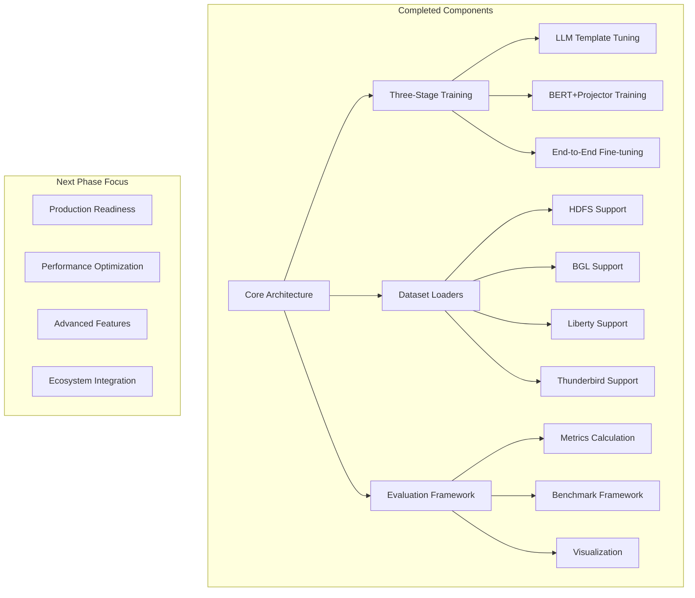
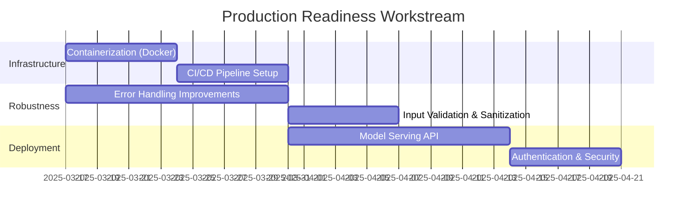
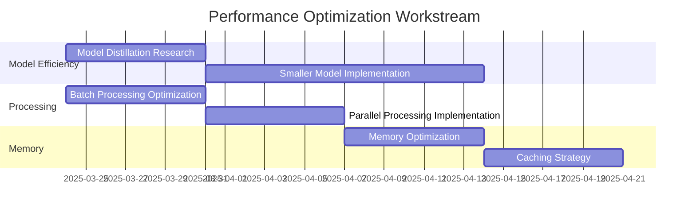
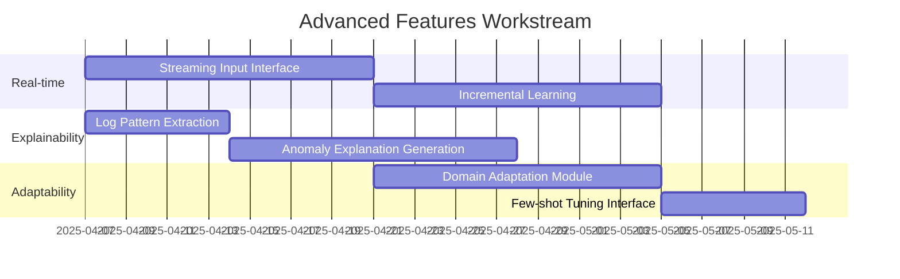
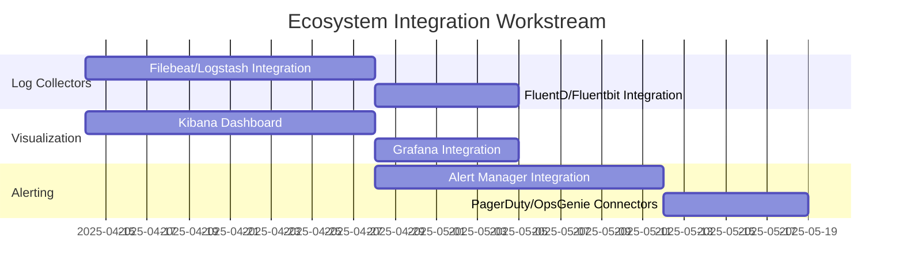
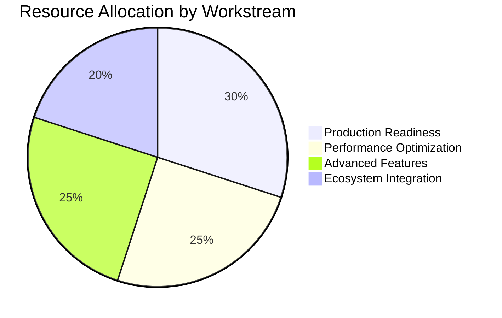
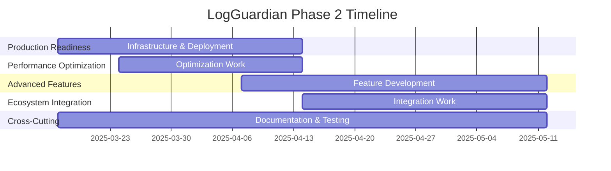

# LogGuardian Implementation Roadmap: Phase 2

Based on my analysis of the current LogGuardian codebase, I'll outline a comprehensive implementation plan for the next phase of development. This roadmap balances advancing core capabilities, improving performance, enhancing usability, and preparing for production deployment.

## Current Status Assessment

## Strategic Objectives for Phase 2

1. **Production Readiness**: Transform LogGuardian from a research prototype to production-ready software
2. **Performance Optimization**: Enhance speed and resource efficiency for real-world deployments
3. **Advanced Features**: Expand capabilities with real-time processing and explainability
4. **Ecosystem Integration**: Enable seamless integration with existing logging and monitoring tools

## Implementation Plan

### 1. Production Readiness (4 weeks)

**Key Deliverables:**
- **Containerization**: Docker container for LogGuardian with appropriate configuration options
- **CI/CD Pipeline**: GitHub Actions workflow for automated testing and deployment
- **Error Handling**: Comprehensive error handling with graceful degradation
- **Model Serving API**: RESTful API for log anomaly detection with proper documentation
- **Security Layer**: Authentication, authorization, and secure communication

**Responsible Stakeholders:** DevOps Engineer, Backend Developer, Security Specialist

**Tasks:**
1. Create Dockerfile and docker-compose.yml for easy deployment
2. Implement GitHub Actions workflow for CI/CD
3. Enhance error handling throughout the codebase
4. Develop a FastAPI-based REST API for model serving
5. Implement authentication and security measures
6. Create deployment documentation

### 2. Performance Optimization (3 weeks)

**Key Deliverables:**
- **Model Variants**: Smaller, faster model options for different deployment scenarios
- **Optimized Processing**: Improved batch processing efficiency and parallel processing
- **Memory Management**: Reduced memory footprint and optimized caching

**Responsible Stakeholders:** Machine Learning Engineer, Performance Engineer

**Tasks:**
1. Research and implement model distillation techniques
2. Optimize batch processing for higher throughput
3. Implement parallel processing for log analysis
4. Optimize memory usage in feature extraction and classification
5. Develop intelligent caching strategies
6. Benchmark and document performance improvements

### 3. Advanced Features (5 weeks)

**Key Deliverables:**
- **Real-time Processing**: Streaming interface for real-time log analysis
- **Explainability**: Methods to explain why a log sequence was flagged as anomalous
- **Domain Adaptation**: Tools for easily adapting to new log formats and domains

**Responsible Stakeholders:** Machine Learning Engineer, Data Scientist, UX Designer

**Tasks:**
1. Develop streaming input interface for real-time log processing
2. Implement incremental learning capabilities
3. Create pattern extraction module for identified anomalies
4. Develop natural language explanation generation for anomalies
5. Design and implement domain adaptation techniques
6. Create an interface for few-shot tuning on new log formats

### 4. Ecosystem Integration (4 weeks)

**Key Deliverables:**
- **Log Collection Integration**: Connectors for popular log collection tools
- **Visualization**: Dashboards for Kibana and Grafana
- **Alerting**: Integration with alerting systems for anomaly notification

**Responsible Stakeholders:** Integration Specialist, DevOps Engineer, Frontend Developer

**Tasks:**
1. Develop connectors for Filebeat/Logstash and FluentD/Fluentbit
2. Create Kibana dashboards for log anomaly visualization
3. Implement Grafana integration
4. Develop Alert Manager integration for anomaly alerting
5. Create connectors for PagerDuty and OpsGenie
6. Develop documentation for all integrations

## Cross-Cutting Concerns

### Documentation (Ongoing)

- **User Documentation**: Comprehensive user guide and tutorials
- **API Documentation**: Detailed API documentation with examples
- **Architecture Documentation**: Updated architecture documentation
- **Integration Guides**: Step-by-step integration guides

### Testing (Ongoing)

- **Unit Tests**: Expand test coverage to >90%
- **Integration Tests**: End-to-end integration tests
- **Performance Tests**: Benchmarking and performance tests
- **Security Tests**: Vulnerability scanning and penetration testing

### Community Building (Ongoing)

- **Contribution Guidelines**: Updated contribution guidelines
- **Issue Templates**: Templates for bugs, features, and questions
- **Community Forums**: Setup community discussion forums
- **Demo Videos**: Create demonstration videos

## Risk Assessment and Mitigation

| Risk | Impact | Likelihood | Mitigation Strategy |
|------|--------|------------|---------------------|
| Performance bottlenecks in real-time processing | High | Medium | Early performance testing, profiling, and optimization |
| Integration challenges with varied log formats | Medium | High | Develop robust preprocessing options and adaptation techniques |
| Model serving failures in production | High | Low | Implement circuit breakers, fallbacks, and monitoring |
| User adoption barriers | Medium | Medium | Focus on UX, documentation, and ease of integration |
| Security vulnerabilities | High | Low | Security reviews, penetration testing, and following best practices |

## Resource Allocation

## Success Metrics

1. **Technical Metrics:**
   - Inference time reduced by 50%
   - Memory usage reduced by 30%
   - Real-time processing latency < 100ms
   - F1 score maintained or improved on benchmark datasets

2. **Project Metrics:**
   - All critical features completed on schedule
   - Test coverage > 90%
   - Zero critical security vulnerabilities
   - All documentation up-to-date and comprehensive

3. **User Metrics:**
   - Successful deployment in at least 3 different environments
   - User onboarding time < 1 day with documentation
   - Positive feedback on usability and integration

## Dependencies and Critical Path

The critical path for this implementation plan is:
1. Production Readiness → Model Serving API
2. Performance Optimization → Batch Processing
3. Advanced Features → Real-time Processing
4. Ecosystem Integration → Log Collection Integration

## Project Timeline Overview

## Conclusion

This implementation plan provides a comprehensive roadmap for transforming LogGuardian from its current state to a production-ready, high-performance log anomaly detection system with advanced features and ecosystem integration. By following this structured approach, we can ensure that the project meets its strategic objectives while minimizing risks and maximizing the value delivered to users.